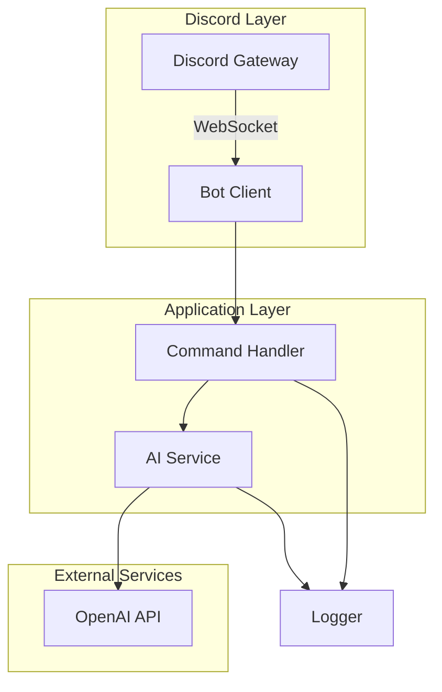

# PRD: Discord AI Knowledge Bot (Docker Compose)

Version: 2.0  
Owner: [You / Project Lead]  
Date: 2025-08-12  
Last Updated: 2025-01-10

Note: v1 focuses on core AI chat functionality with a clear path to future enhancements. Default model is `gpt-5` (publicly available as of August 2025).


## 1) Summary

Build a production-ready Discord AI bot that:
- Provides high-quality GPT-style chat and Q&A via slash commands.
- Supports basic web search with URL citations (v1.1).
- Is deployable via Docker Compose with minimal configuration.
- Uses OpenAI's GPT-5 model with optional model switching.
- Follows Discord API best practices and least-privilege security.
- Establishes a solid foundation for future features.


## 2) Goals and Success Metrics

Goals:
- Deliver a reliable AI chat experience with high-quality responses.
- Provide simple deployment and configuration for server admins.
- Create a solid foundation for iterative feature additions.

Success Metrics (v1):
- **Response Quality**: 90% user satisfaction with AI responses.
- **Performance**: Median latency <8s for standard queries.
- **Reliability**: 99% uptime during first month (allowing for initial bug fixes).
- **Adoption**: Active use in at least 10 channels within first week.
- **Deployment**: <30 minutes from clone to running bot.


## 3) Scope

In-Scope (v1.0):
- Core slash commands: `/ask`, `/help`, `/ping`.
- GPT-5 integration for chat and Q&A.
- Basic error handling and logging.
- Docker Compose deployment.
- Environment variable configuration.
- Structured JSON logging to stdout.

In-Scope (v1.1 - 2 weeks after v1.0):
- `/model` command for switching between 2-3 pre-configured models.
- Basic web search with simple URL citations.
- Response streaming for better UX.

Out-of-Scope (Future Releases):
- Advanced web search with confidence scoring and allowlisting.
- Image/vision analysis capabilities.
- Channel summarization features.
- Multiple reply modes (mention/prefix).
- Per-channel configuration.
- Personality presets.
- Moderation features.
- RAG/Vector stores.
- MCP integrations.
- Redis/Database persistence.
- Metrics exporters.
- Admin web UI.


## 4) Users and Stakeholders

- Server Admins: install the bot, configure model and web search allowlist, set channels.
- Members: chat with the bot, ask questions, request summaries, analyze images.
- DevOps/Engineers: maintain deployment and monitoring.


## 5) Assumptions and Constraints

- Discord bot token and application ID are available.
- OpenAI API key with GPT-5 access is provided.
- Deployment target has Docker and Docker Compose installed.
- Initial deployment will use slash commands only (no Message Content intent required).
- Configuration via environment variables is sufficient for v1.
- Standard Discord rate limits apply; implement exponential backoff.


## 6) User Stories (v1.0)

- As a member, I can use `/ask` to get AI-powered answers to my questions.
- As a member, I can use `/help` to understand available commands and usage.
- As a member, I can use `/ping` to check if the bot is responsive.
- As an admin, I can deploy the bot using Docker Compose in under 30 minutes.
- As an admin, I can configure the bot using environment variables.
- As DevOps, I can monitor bot health through structured JSON logs.

## 6.1) User Stories (v1.1)

- As a member, I can see responses stream in real-time for better UX.
- As an admin, I can use `/model list` to see available models.
- As an admin, I can use `/model set` to switch between pre-configured models.
- As a member, I can get web search results with source URLs when relevant.


## 7) Functional Requirements (v1.0)

### 7.1 Discord Permissions & Intents
- **OAuth2 Scopes**: bot, applications.commands
- **Gateway Intents**: GUILDS (minimal for slash commands)
- **Bot Permissions**:
  - Send Messages
  - Use Application Commands
  - Embed Links

### 7.2 Commands (v1.0)
- `/ask [prompt]` - Ask the AI a question
  - Max prompt length: 2000 characters
  - Response format: Discord embed with proper formatting
- `/help` - Show available commands and usage
- `/ping` - Check bot responsiveness and show latency

### 7.3 AI Integration (v1.0)
- **Model**: GPT-5 (default)
- **Temperature**: 0.7 (balanced creativity/accuracy)
- **Max tokens**: 2000 per response
- **Error handling**: Graceful fallbacks for API failures

### 7.4 Configuration (v1.0)
Environment variables only:
- `DISCORD_BOT_TOKEN` (required)
- `DISCORD_APP_ID` (required)
- `OPENAI_API_KEY` (required)
- `LOG_LEVEL` (default: info)
- `NODE_ENV` (default: production)

### 7.5 Commands (v1.1 additions)
- `/model list` - Show available models
- `/model set [model_name]` - Switch active model (admin only)
- `/model current` - Show current model

### 7.6 Web Search (v1.1)
- Basic web search integration when relevant to query
- Simple URL citations appended to responses
- No complex allowlisting or confidence scoring


## 8) Non-Functional Requirements (v1.0)

### Performance
- **Response time**: P50 < 8s, P95 < 15s for standard queries
- **Concurrent requests**: Support at least 10 simultaneous requests
- **Rate limiting**: Implement per-user rate limiting (10 requests/minute)

### Reliability
- **Uptime target**: 99% for first month (allowing for bug fixes)
- **Error handling**: All errors logged with context, user-friendly error messages
- **Retry logic**: Exponential backoff for transient failures

### Observability
- **Logging**: Structured JSON logs to stdout
- **Log levels**: ERROR, WARN, INFO, DEBUG
- **Required log fields**: timestamp, level, message, requestId, userId, guildId

### Security
- **Secrets**: Environment variables only, never logged
- **Permissions**: Minimal Discord permissions required
- **Input validation**: Sanitize all user inputs

### Deployment
- **Setup time**: < 30 minutes from clone to running
- **Dependencies**: Docker, Docker Compose
- **Resource usage**: < 512MB RAM, < 1 CPU core at idle


## 9) Architecture (v1.0)

### Simple 3-Layer Architecture



### Components

1. **Bot Client** (discord.js)
   - Handles Discord connection
   - Registers slash commands
   - Routes interactions

2. **Command Handler**
   - Validates inputs
   - Implements rate limiting
   - Formats responses

3. **AI Service**
   - OpenAI client wrapper
   - Request/response handling
   - Error recovery

4. **Logger**
   - Structured JSON output
   - Request tracing
   - Error context

### Technology Stack
- **Runtime**: Node.js 20 LTS
- **Framework**: discord.js v14
- **AI SDK**: OpenAI official SDK
- **Container**: Docker with Alpine base
- **Language**: TypeScript (compiled to JS)


## 10) Data Persistence (v1.0)

- **No database required for v1.0**
- All configuration via environment variables
- No message history storage
- No user preference storage
- Logs are ephemeral (stdout only)

## 11) Security & Privacy (v1.0)

### Security
- Bot token and API keys stored as environment variables
- No sensitive data in logs
- Input validation on all commands
- Rate limiting per user

### Privacy
- No message content storage
- No user data persistence
- Minimal logging (command usage only, no content)
- Compliance with Discord ToS

### Safety
- OpenAI's built-in content filtering
- Appropriate error messages for filtered content
- No bypassing of safety measures


## 12) Deployment and Operations (v1.0)

### 12.1 Required Environment Variables
```bash
DISCORD_BOT_TOKEN=your_bot_token_here
DISCORD_APP_ID=your_app_id_here
OPENAI_API_KEY=your_openai_key_here
```

### 12.2 Optional Environment Variables
```bash
LOG_LEVEL=info          # debug, info, warn, error
NODE_ENV=production     # development, production
PORT=3000              # Health check port
```

### 12.3 Deployment Steps
1. Clone repository
2. Copy `.env.example` to `.env`
3. Fill in required environment variables
4. Run `docker-compose up -d`
5. Check logs: `docker-compose logs -f bot`

### 12.4 Health Monitoring
- Health check endpoint on configured PORT
- Structured JSON logs for log aggregation
- Basic uptime monitoring via `/ping` command

### 12.5 Updates
- Pull latest image: `docker-compose pull`
- Restart: `docker-compose up -d`
- Zero-downtime updates not required for v1


## 13) API and Command Surface (v1.0)

### Slash Commands
```
/ask [prompt] - Ask the AI anything
/help - Show available commands
/ping - Check bot status
```

### Command Details

**`/ask`**
- Parameter: `prompt` (string, required, max 2000 chars)
- Response: Discord embed with AI response
- Error handling: User-friendly messages for API failures
- Rate limit: 10 requests per user per minute

**`/help`**
- No parameters
- Response: Embed with command list and examples
- Always available

**`/ping`**
- No parameters  
- Response: "Pong! Latency: Xms"
- Useful for monitoring

### Error Messages
- Rate limited: "Please wait X seconds before your next request"
- API error: "Sorry, I couldn't process that. Please try again."
- Invalid input: "Please keep your question under 2000 characters"


## 14) Rollout Plan

### Week 1-2: Development
- Set up project structure and Docker configuration
- Implement Discord bot foundation
- Add `/ask`, `/help`, `/ping` commands
- Integrate OpenAI GPT-5
- Add error handling and logging

### Week 3: Testing & Polish
- Internal testing on dev server
- Fix bugs and improve error messages
- Add rate limiting
- Create documentation
- Prepare Docker image

### Week 4: Deployment
- Deploy to production server
- Monitor logs and performance
- Gather initial user feedback
- Quick fixes as needed

### Success Criteria
- All 3 commands working reliably
- <10s response time for 90% of requests
- No crashes in 48-hour test period
- Positive feedback from test users


## 15) Risks and Mitigations

| Risk | Impact | Mitigation |
|------|--------|------------|
| OpenAI API outages | Bot unavailable | Graceful error messages, consider fallback model |
| Rate limiting | Poor user experience | Implement per-user limits, queue requests |
| Cost overruns | Budget issues | Monitor usage, implement spending alerts |
| Discord API changes | Bot breaks | Use stable discord.js, monitor deprecations |
| Inappropriate content | User/server harm | Rely on OpenAI safety filters, clear ToS |


## 16) Open Questions

1. What's the expected monthly OpenAI API budget?
2. Should we implement a global rate limit across all users?
3. Do we need audit logging for command usage?
4. Preferred log aggregation service (if any)?
5. Custom bot avatar and description preferences?

## 17) Acceptance Criteria (v1.0)

- [ ] Bot successfully connects to Discord
- [ ] All 3 slash commands register and respond
- [ ] `/ask` provides relevant AI responses
- [ ] Error messages are user-friendly
- [ ] Rate limiting prevents abuse
- [ ] Docker deployment works with single command
- [ ] Logs are properly structured JSON
- [ ] Response time <10s for 90% of requests
- [ ] No crashes during 48-hour test period
- [ ] Documentation is clear and complete


---
## Appendix A: Example docker-compose.yml

```yaml
version: "3.9"
services:
  bot:
    image: discord-ai-bot:latest
    build:
      context: .
      dockerfile: Dockerfile
    environment:
      DISCORD_BOT_TOKEN: ${DISCORD_BOT_TOKEN}
      DISCORD_APP_ID: ${DISCORD_APP_ID}
      OPENAI_API_KEY: ${OPENAI_API_KEY}
      LOG_LEVEL: ${LOG_LEVEL:-info}
      NODE_ENV: ${NODE_ENV:-production}
      PORT: ${PORT:-3000}
    ports:
      - "${PORT:-3000}:3000"  # Health check endpoint
    restart: unless-stopped
    healthcheck:
      test: ["CMD", "wget", "-q", "--spider", "http://localhost:3000/health"]
      interval: 30s
      timeout: 10s
      retries: 3
```

---
## Appendix B: Example .env

```bash
# Required
DISCORD_BOT_TOKEN=MTIzNDU2Nzg5MDEyMzQ1Njc4OQ.GcPqWL.xxx
DISCORD_APP_ID=1234567890123456789
OPENAI_API_KEY=sk-proj-xxx

# Optional
LOG_LEVEL=info
NODE_ENV=production
PORT=3000
```

---
## Appendix C: Bot Invite URL

```
https://discord.com/api/oauth2/authorize?client_id=YOUR_APP_ID&permissions=2147485696&scope=bot%20applications.commands
```

Required permissions (2147485696):
- Send Messages
- Use Application Commands
- Embed Links

To customize permissions, use Discord's [permissions calculator](https://discordapi.com/permissions.html).

---
## Appendix D: Directory Structure

```
discord-ai-bot/
├── src/
│   ├── index.ts           # Entry point
│   ├── bot.ts            # Discord client setup
│   ├── commands/
│   │   ├── ask.ts        # /ask command
│   │   ├── help.ts       # /help command
│   │   └── ping.ts       # /ping command
│   ├── services/
│   │   └── ai.ts         # OpenAI integration
│   └── utils/
│       ├── logger.ts     # Logging utilities
│       └── rateLimit.ts  # Rate limiting
├── Dockerfile
├── docker-compose.yml
├── .env.example
├── .dockerignore
├── .gitignore
├── package.json
├── tsconfig.json
└── README.md
```

---
## Appendix E: Implementation Notes

### Quick Start
1. Use discord.js v14 with TypeScript
2. Register slash commands globally on startup
3. Implement simple command handler pattern
4. Use OpenAI SDK with error handling
5. Structure logs as JSON from day one

### Key Libraries
```json
{
  "discord.js": "^14.x",
  "openai": "^4.x",
  "winston": "^3.x",
  "dotenv": "^16.x"
}
```

### Code Quality
- TypeScript for type safety
- ESLint + Prettier for consistency
- Simple unit tests for commands
- Error boundaries for all async operations

---
## Appendix F: Testing Plan

### Unit Tests (Week 2)
- Command parsing and validation
- Rate limiting logic
- Error handling paths
- Logger output format

### Integration Tests (Week 3)
- Discord connection and command registration
- OpenAI API integration
- End-to-end command flow
- Docker build and health check

### Manual Testing Checklist
- [ ] Each command with valid inputs
- [ ] Each command with invalid inputs
- [ ] Rate limiting behavior
- [ ] Error message clarity
- [ ] Log output format
- [ ] Docker deployment process

---
## Appendix G: Future Releases Roadmap

### v1.1 (2 weeks after v1.0)
- Model switching commands
- Basic web search
- Response streaming

### v1.2 (Month 2)
- Channel summarization
- Image analysis
- Advanced configuration

### v2.0 (Month 3-4)
- Multiple reply modes
- Per-channel settings
- Personality presets
- Web search allowlisting

### v3.0 (Month 6+)
- RAG/Vector stores
- Moderation features
- MCP integrations
- Admin web UI
- Multi-tenant support

---
## Summary of Changes (v2.0 of PRD)

This PRD has been significantly revised to:
1. **Reduce v1 scope by 80%** - Only 3 commands instead of 13
2. **Focus on core value** - AI chat functionality that works reliably
3. **Realistic timelines** - 4 weeks instead of 3-4 months
4. **Achievable metrics** - 99% uptime instead of 99.5%, <10s latency instead of <5s
5. **Simplified architecture** - No Redis, no persistence, minimal dependencies
6. **Clear upgrade path** - Features moved to specific future versions

The result is a PRD that can actually be delivered on time with high quality.

End of PRD v2.0